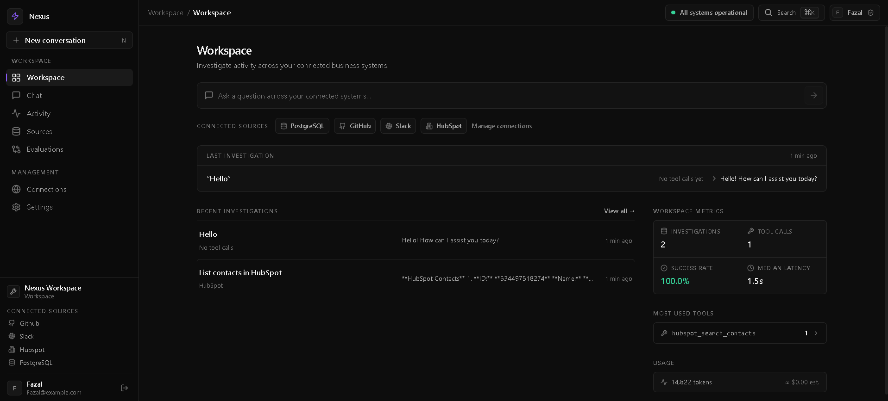

# Nexus

Enterprise MCP Intelligence Platform



## Problem

Enterprise teams have critical data scattered across communication platforms (Slack), development tools (GitHub), CRM systems (HubSpot), and databases (PostgreSQL). Answering cross-functional questions like "What blockers did the engineering team discuss last sprint, and are there corresponding unresolved GitHub issues?" requires manually switching between 4+ tools, copying context, and synthesizing information by hand. This costs hours per week per engineer and leads to missed connections between systems.

## Solution

Nexus connects an AI assistant to multiple enterprise data sources through the Model Context Protocol (MCP). Users ask natural-language questions in a chat interface. The system determines which data sources are needed, retrieves information across systems, synthesizes a coherent answer with source citations, and optionally executes write actions with confirmation.

The AI orchestrator intelligently selects which MCP tools to call, executes them in the right order (parallelizing independent calls), and combines results from multiple sources into a single grounded response.

## Architecture

```
                ┌─────────────────────────┐
                │       React Frontend    │
                │                         │
                │ Chat / Sources / Tools  │
                │ Settings / Observability│
                └────────────┬────────────┘
                             │
                          HTTPS
                             │
                ┌────────────▼────────────┐
                │      FastAPI Backend    │
                │                          │
                │ Auth / Chat / Sources    │
                │ Sessions / SSE           │
                └────────────┬─────────────┘
                             │
                ┌────────────▼─────────────┐
                │     AI Orchestrator      │
                │                           │
                │ Intent / Tool Selection  │
                │ Tool Execution            │
                │ Context Management       │
                │ Answer Synthesis          │
                └────────────┬─────────────┘
                             │
                     MCP Protocol
                             │
           ┌─────────────────┼─────────────────┐
           │                 │                 │
   ┌───────▼───────┐ ┌──────▼──────┐ ┌──────▼──────┐
   │ GitHub MCP    │ │ Slack MCP   │ │ HubSpot MCP │
   │ Server        │ │ Server      │ │ Server      │
   └───────┬───────┘ └──────┬──────┘ └──────┬──────┘
           │                │                │
        GitHub            Slack           HubSpot
           │                │                │
           └────────────────┼────────────────┘
                            │
                   ┌────────▼────────┐
                   │ PostgreSQL MCP  │
                   └────────┬────────┘
                            │
                       PostgreSQL
```

## Features

- **Multi-source AI queries** — Ask questions that span Slack, GitHub, HubSpot, and PostgreSQL
- **MCP protocol** — Standard tool-calling interface for all integrations
- **Streaming responses** — Real-time answer generation with tool activity trace
- **Source citations** — Every answer links to its sources (Slack messages, GitHub issues, CRM records)
- **SQL safety** — Read-only PostgreSQL access with parameterized queries, timeouts, and row limits
- **Prompt injection defense** — External content treated as untrusted data
- **Analytics dashboard** — Query metrics, latency, cost tracking, tool usage
- **Real integrations** — Live GitHub, Slack, HubSpot, and PostgreSQL connections via OAuth or API tokens

## Tech Stack

| Layer | Technology |
|-------|-----------|
| Frontend | React, TypeScript, Vite, Tailwind CSS, shadcn/ui, TanStack Query |
| Backend | Python 3.12, FastAPI, Pydantic, SQLAlchemy, Alembic |
| Database | PostgreSQL 16 |
| Cache | Redis 7 |
| MCP Servers | Native HTTP integrations (GitHub, Slack, HubSpot, PostgreSQL) |
| AI | OpenRouter (configurable — supports OpenAI, Anthropic, Groq) |
| Infrastructure | Docker, Docker Compose, GitHub Actions |

## Local Development

### Prerequisites

- Docker and Docker Compose
- Node.js 20+ (for local frontend dev)
- Python 3.12+ (for local backend dev)

### Quick Start (Docker)

```bash
# Clone and configure
cp .env.example .env

# Start everything
docker compose up --build

# Open
open http://localhost:5173
```

> The first time you open the app you create your own account (name, email,
> password) on the login screen. Every user is registered and authenticated
> against the API — there is no built-in or default account.

### Local Development

```bash
# Backend
cd apps/api
python -m venv .venv
source .venv/bin/activate
pip install -r requirements.txt
alembic upgrade head
uvicorn app.main:app --reload

# Frontend
cd apps/web
npm install
npm run dev
```

## Environment Variables

See [`.env.example`](.env.example) for all configuration options.

Key variables:
- `LLM_PROVIDER=openrouter` — Use OpenRouter for free LLM access
- `LLM_MODEL=openai/gpt-oss-20b:free` — Free model with tool calling support
- `DATABASE_URL` — PostgreSQL connection string
- `JWT_SECRET` — Session signing key
- `ENCRYPTION_KEY` — Credential encryption key

### LLM Providers

| Provider | Env Var | Free Tier |
|----------|---------|-----------|
| OpenRouter | `OPENROUTER_API_KEY` | Yes (`openai/gpt-oss-20b:free`) |
| Groq | `GROQ_API_KEY` | Yes (rate limited) |
| OpenAI | `OPENAI_API_KEY` | No |
| Anthropic | `ANTHROPIC_API_KEY` | No |

## Connecting Integrations

| Source | Auth Method | Setup |
|--------|------------|-------|
| GitHub | OAuth / API Token | Settings > Sources > GitHub |
| Slack | OAuth | Settings > Sources > Slack |
| HubSpot | Private App Access Token | Settings > Sources > HubSpot |
| PostgreSQL | Connection string | Settings > Sources > PostgreSQL |

## Example Queries

1. "What blockers did the engineering team discuss during the last sprint?"
2. "Find a contact in HubSpot and tell me what issues they reported in Slack."
3. "Which GitHub issues are currently blocking the platform project?"
4. "Which deals are currently in negotiation?"
5. "Compare customer-reported issues in Slack with the open GitHub issues."
6. "What are the biggest unresolved customer problems this week?"
7. "Which customer mentioned authentication problems?"
8. "Create a GitHub issue for the highest-priority unresolved customer problem."

## Security

- Credentials encrypted at rest with Fernet
- OAuth tokens never exposed to frontend
- PostgreSQL MCP uses read-only database role
- SQL injection prevented via parameterized queries
- Prompt injection defended by content/untrusted-data separation
- Rate limiting per user and per organization
- Structured logging without sensitive data

See [docs/security/](docs/security/README.md) for full security documentation.

## Deployment

See [docs/deployment/](docs/deployment/) for:
- **Docker Compose** (development and production)
- **AWS** (ECS Fargate + RDS + ElastiCache)

## Documentation

- [Architecture Decision Records](docs/adr/) — 5 ADRs covering MCP, LLM abstraction, Postgres security, OAuth storage, tool routing
- [Security Documentation](docs/security/README.md)
- [Deployment Guide](docs/deployment/README.md)
- [Case Study](docs/case-study.md)

## Limitations

- Rate limits are in-memory — not distributed across instances
- No enterprise SSO (SAML/OIDC) in initial release
- HubSpot integration limited to contacts, companies, and deals

## Future Improvements

- Write action confirmation UI
- Additional MCP connectors (Jira, Linear, Notion, Confluence)
- Enterprise SSO with SAML/OIDC
- Distributed rate limiting with Redis
- Advanced RBAC with permission-aware retrieval
- Playwright E2E tests
- Evaluation benchmarking suite

## License

MIT
